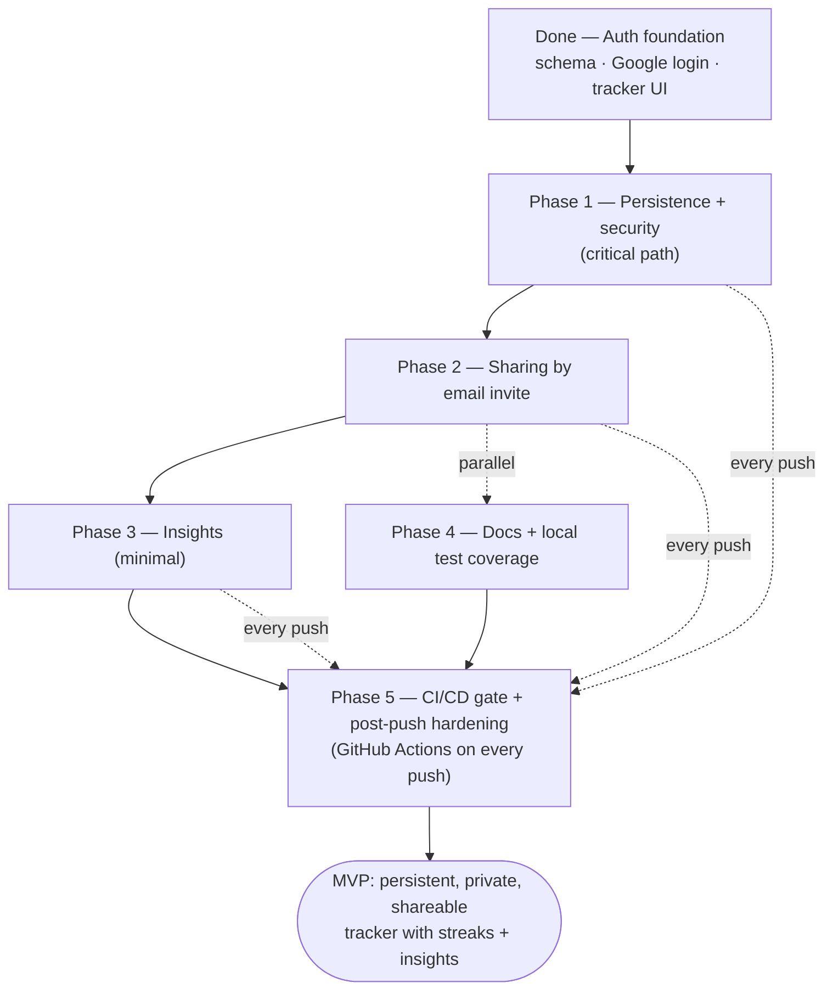

# HabitLab — MVP Roadmap

**Goal:** a persistent, private habit tracker that a user can **share with another account by email**, that **computes streaks**, and **surfaces insights**.

**Starting point (today):** ~55% — polished single-user demo. Auth Chunks 1–2 done (Prisma schema, Google login). Habits still live in an in-memory store shared by everyone; nothing is persisted or isolated per user.

The one structural change vs. the old Cursor plans: the MVP now includes **sharing**, which the old plans didn't cover. Sharing is added as **Phase 2**, layered on top of the existing Chunk 3 persistence work.

---

## Next steps at a glance



**Why this order:** Phase 1 turns habits into real, per-user, persisted data. Sharing and insights are meaningless until each user owns isolated rows in Postgres, so **Phase 1 is the gate for everything else**. Phase 4 (docs/tests) can run alongside once Phase 2 lands.

**Phase 5 is not just a final step — it's a gate that runs on every push.** Each phase's code only counts as "done" once its PR is green in GitHub Actions and merged behind branch protection. The dashed "every push" arrows show that CI validates every phase as you go; the solid arrow into the MVP marks the point where the full pipeline (including DB migrations and sharing E2E) is trusted end-to-end.

---

## Phase 1 — Persistence + security (was "Auth Chunk 3")

This is the existing, fully-specced Chunk 3. It's the largest and most important piece. Nothing about the MVP works without it.

**Build**

1. `src/lib/dates.ts` — make timezone-aware: every date-key function (`getDateKey`, `getRollingDateKeys`, `isDateInRollingWindow`, `isDateTrackable`, `formatDateRowLabel`, `isWeekendDateKey`) takes an IANA timezone parameter and computes with it (no more `toISOString()`/server-local defaults for real usage; UTC remains only as an explicit fallback when a timezone is missing).
2. `src/lib/habit-mapper.ts` — bidirectional Prisma ↔ API mapping: category (`spiritual-growth` ↔ `SPIRITUAL_GROWTH`), frequency, `createdAt` date, `completedDates[]` ↔ `completions[].date`, plus a `completedToday` flag via `getDateKey()` using the caller's timezone.
3. `src/lib/habits-db.ts` — user-scoped Prisma repository. Every function takes `userId`: `listHabits`, `createHabit`, `updateHabit`, `archiveHabit`, `unarchiveHabit`, `applyCompletions`. Ownership enforced with `where: { id, userId }`.
4. Refactor `src/lib/habit-store.ts` — keep validation helpers (30-day window, `isDateTrackable`, allowed categories); remove the in-memory array. Switch habit IDs from `Date.now()` to Prisma autoincrement.
5. Secure `/api/habits` and `/api/habits/completions` — `getServerSession(authOptions)`; return **401** with no session, **404** on cross-user `habitId`. Read the client's IANA timezone from a request header (e.g. `X-Timezone`), validate it, and thread it into the mapper/date logic; fall back to UTC only if the header is missing or invalid. Also persist the validated value onto `User.timezone` on each authenticated request, so a user's most recent timezone stays available for shared-view stat computation even when someone else is viewing their tracker.
6. `src/middleware.ts` — `withAuth` protecting `/dashboard`, `/tracker`, `/habits`, `/api/habits*`; redirect to `/login?callbackUrl=…`.
7. Home page — redirect signed-in users to the dashboard (or show a CTA).
8. Un-archive: `unarchiveHabit()` clearing `archivedAt`, plus a minimal archived-habits view with a restore action, so the "reversible" archive claim in `PRODUCT.md` actually has a UI path.

**Done when**

- [ ] Create a habit → restart server → it's still there.
- [ ] User A and User B see isolated lists.
- [ ] `PATCH` with another user's `habitId` → 404.
- [ ] `GET /api/habits` without a session → 401.
- [ ] `/habits` without a session → redirect to `/login`.
- [ ] Tracker completions persist within the 30-day window.
- [ ] A completion near local midnight lands on the correct day for a non-UTC timezone.
- [ ] Archiving then un-archiving a habit restores it to the active tracker with history intact.

---

## Phase 2 — Sharing by email invite (new)

Let an owner invite another account, by email, to see their tracker. Read-only ("view") sharing keeps the MVP small; edit access can come later.

**Schema (new Prisma model)**

```prisma
model HabitShare {
  id             Int         @id @default(autoincrement())
  ownerId        String                      // User.id of the sharer
  invitedEmail   String                      // email the owner typed
  invitedUserId  String?                     // filled in when that account exists / accepts
  permission     SharePermission @default(VIEW)
  status         ShareStatus     @default(PENDING)
  createdAt      DateTime    @default(now())

  owner        User  @relation("SharesFromMe", fields: [ownerId], references: [id])
  invitedUser  User? @relation("SharesToMe", fields: [invitedUserId], references: [id])

  @@unique([ownerId, invitedEmail])
  @@index([invitedEmail])
  @@index([invitedUserId])
}

enum SharePermission { VIEW EDIT }
enum ShareStatus     { PENDING ACCEPTED REVOKED }
```

Add the matching back-relations on `User`. Run a migration (`add_habit_sharing`).

**Flow**

1. **Invite:** owner enters an email on a "Share" screen → create `HabitShare(status = PENDING)`, or reactivate an existing row for that `(ownerId, invitedEmail)` pair back to `PENDING` if one already exists (revoked or previously pending) rather than inserting a duplicate — the pair is unique. If a `User` with that email already exists, set `invitedUserId` immediately.
2. **Accept:** on sign-in, resolve pending invites for the user's email — only for accounts with `emailVerified` set — (match on `invitedEmail`), show them, let the user accept → `status = ACCEPTED`, `invitedUserId` set.
3. **View:** an accepted share lets the invited user open the owner's tracker read-only via a "Shared with me" switcher.
4. **Revoke:** owner can set `status = REVOKED` (or delete the row).

**Access-rule change (small but important):** in `habits-db.ts`, reads for a given tracker are allowed if the requester is the owner **or** has an `ACCEPTED` share for that owner. Writes remain owner-only for the MVP (VIEW permission). Keep this check in one helper so every route uses the same logic. This includes archived-habit exclusion: `listHabitsForOwner` must exclude `archivedAt`-set habits for both the owner and any accepted-share requester — the guarantee lives at the data layer, not only in the tracker UI. It also includes timezone: shared-tracker stats compute date keys using the *owner's* persisted `User.timezone`, not the viewer's own — never the requester's `X-Timezone` header for someone else's tracker.

**API / UI**

- `src/app/api/shares/route.ts` — `GET` (my shares, both directions), `POST` (create invite), `PATCH` (accept), `DELETE` (revoke).
- A `/share` (or dialog in `/habits`) screen for inviting + listing.
- A tracker/dashboard "viewing: <owner>" context selector; hide edit controls when not the owner.

**Done when**

- [ ] Owner invites an email → invite recorded as PENDING.
- [ ] Invited account sees the pending invite and accepts.
- [ ] Accepted user sees the owner's tracker read-only; cannot edit.
- [ ] A non-invited account gets 404/403 for that tracker.
- [ ] Revoking removes the invited user's access.

> **Scope note — "same email":** this plan implements *explicit invites by email* (owner picks who). It is **not** domain-wide auto-sharing (everyone `@acts2.network` in one workspace) and **not** multi-login account linking. If you later want the whole domain to share automatically, that's a different, larger model — flag it before building.

---

## Phase 3 — Insights (minimal)

Keep what already exists; just make sure it runs on real data.

- Streaks and completion rates (`habit-stats.ts`) compute correctly against DB-backed habits/completions.
- Stats render correctly for both the owner's own tracker and a shared ("viewing someone else") tracker.
- No new charts or generated insights for the MVP. (`recharts` and richer "smart insights" are a deliberate post-MVP item — decide to use or remove `recharts`/`@tanstack/react-query` later.)

**Done when**

- [ ] Dashboard streak + rate numbers match a hand-checked example.
- [ ] Same numbers are correct when viewing a shared tracker.

---

## Phase 4 — Docs + local test coverage (was "Chunk 4")

Can start once Phase 2 is merged; runs in parallel with Phase 3. This phase is about *writing* the tests and docs; Phase 5 is about *enforcing* them in CI.

- README: Google Console setup, `NEXTAUTH_SECRET`, local sign-in, production env vars + redirect URIs, Testing vs Published OAuth consent screen. (`.env.example` already done.)
- Update the E2E reset strategy for DB-backed habits (the current `/api/test/reset` clears an in-memory store — it needs to truncate test DB tables instead).
- New tests: `habits-db` unit tests, sharing invite/accept/access unit + E2E, session-guard tests on the secured APIs, `habit-mapper` round-trip tests.
- Full happy-path E2E: sign in → create → persist → invite → accept → view shared tracker.

**Done when**

- [ ] README lets a new dev configure Google OAuth and run sign-in locally.
- [ ] E2E covers create → persist → share → accept → view.
- [ ] All new suites pass locally (`vitest` + `playwright`).

---

## Phase 5 — CI/CD gate + post-push hardening (GitHub Actions)

This is the "after push to the repo" layer: everything that runs automatically once code lands on a branch or PR. It's the gate that makes each earlier phase actually trustworthy. You already have `ci.yml` and `migrate.yml` — this phase extends and enforces them.

**CI pipeline (`ci.yml`) — runs on every push and PR**

- Keep the existing chain: `lint → type-check → vitest → build`.
- Add a **Postgres service container** so DB-backed tests and the Playwright E2E run against a real database (not the old in-memory store). Run `prisma migrate deploy` against it before tests.
- Run the Playwright job with the DB-backed test reset from Phase 4.
- Cache `node_modules` / Prisma client to keep runs fast.
- Fail the build on any type error, lint error, or failing test — no `continue-on-error`.

**Migrations (`migrate.yml`)**

- Confirm it runs `prisma migrate deploy` on merge to `main` (and/or on deploy), covering the new `add_habit_sharing` migration.
- Guard against drift: add a check that `prisma migrate status` is clean, so a PR that changes the schema without a migration fails CI. This check only becomes meaningful once the `add_habit_archive` and `add_habit_sharing` migrations actually exist — sequence the drift-check ticket after both, not just after the CI groundwork.

**Branch protection & required checks**

- Protect `main`: require the CI workflow to pass before merge, require PR review, and require the branch to be up to date. This is what turns "CI exists" into "CI is a gate."
- Each phase's PR (1, 2, 3) is only "done" once its checks are green here.

**Post-push hardening**

- Add a scheduled/`on: push` **`npm audit` / dependency-review** step and enable **Dependabot** for dependency and GitHub Actions version bumps.
- Enable **secret scanning** / push protection so `NEXTAUTH_SECRET`, DB URLs, and Google client secrets can't be committed.
- Pin third-party actions to a commit SHA and set minimal `permissions:` in each workflow (supply-chain hardening).
- Add a smoke test against the preview/production deploy (hit `/`, `/login`, and one authenticated route) so a green build that fails to boot is caught.

**Done when**

- [ ] CI runs the full DB-backed test + E2E suite on every PR and fails on any error.
- [ ] `main` is branch-protected; merges require green checks + review.
- [ ] `migrate.yml` applies the sharing migration on deploy; schema-drift is caught in CI.
- [ ] Dependabot + secret scanning + dependency audit are active.
- [ ] A post-deploy smoke test passes before a release is considered good.

---

## Suggested PR / branch sequence

1. **PR 0 — CI/CD groundwork** (start of Phase 5). Add the Postgres service container + branch protection *early*, so PRs 1–3 are gated from day one rather than retrofitted at the end.
2. **PR 1 — persistence + security** (Phase 1). Ship-able on its own; the app becomes a real multi-user product.
3. **PR 2 — sharing** (Phase 2). Depends on PR 1.
4. **PR 3 — docs + tests** (Phase 4), plus the small Phase 3 verification. Can overlap PR 2.
5. **PR 4 — hardening** (rest of Phase 5): Dependabot, secret scanning, audit, migration-drift check, deploy smoke test.

Every PR above must be green in GitHub Actions before merge — that's the point of doing PR 0 first.

## Explicitly out of scope for the MVP

Weekly/monthly habit frequency (schema allows it, UI is daily-only — decide later), domain-wide auto-sharing, edit-permission sharing, account linking, Auth.js v5 upgrade, example-habit seeding, richer charted/generated insights, rate limiting / brute-force protection on habit and share endpoints (documented post-MVP hardening item; cross-user 404s already block unauthorized access), Server-Component conversion of `dashboard`/`habits`/`tracker` pages — currently full client components with a fetch-on-mount waterfall; real performance debt, but not required for any MVP "Done when" checklist (see `TICKETS.md` post-MVP backlog, HAB-84).
